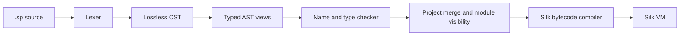
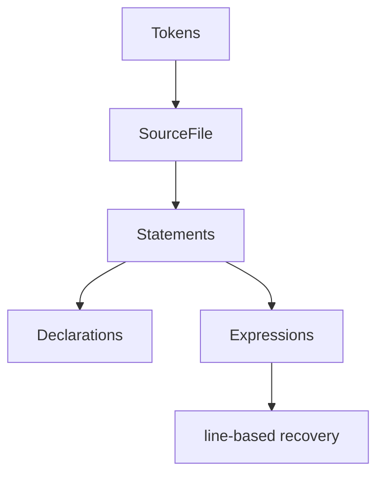
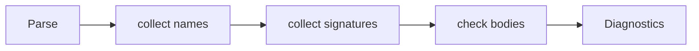

# Compiler Architecture

Spider's implemented pipeline is:

## Lexer

The lexer produces tokens and diagnostics. It also inserts zero-width
`Indent`/`Dedent` tokens. Newlines inside brackets are trivia.

## Parser

The parser is recursive descent and error tolerant.

Guarantees:

- never panic on any input;
- preserve every byte of input in the tree;
- report independent errors in source order;
- cap nesting depth.

## Semantic Checker

The checker resolves names, checks mutability, infers types, checks module
members against the stdlib registry, verifies match exhaustiveness, validates
`try`, and applies capability policy.

## Project Checker

M5 adds `check_project`, which merges type names, per-module signatures, exports
and constructors, then checks each module body with the merged world.

## Bytecode Generator

The compiler lowers CST-shaped typed programs to register instructions. It
assumes the checker has already accepted the program; inconsistencies are
toolchain bugs, not user diagnostics.

