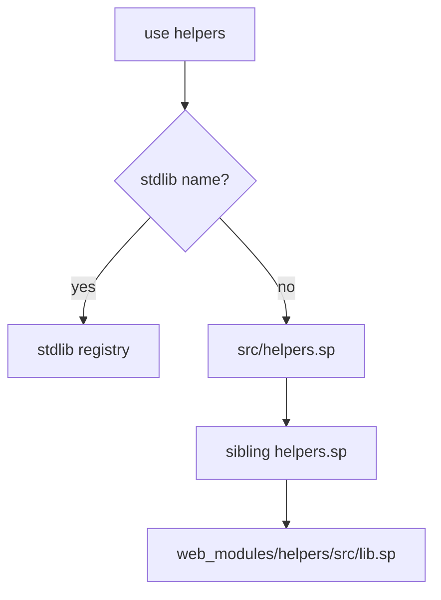

# Package Loader and Registry

## Loader

The loader maps imports to files and packages.

Stdlib names cannot be shadowed by files. Cycles are reported with the cycle
path.

## Registry

The local registry copies packages into `~/.spider/registry/<name>/<version>`.
Published versions are immutable. Installs copy package files into
`web_modules`, write `web.lock`, update `web.toml`, and refuse capability
escalation.
