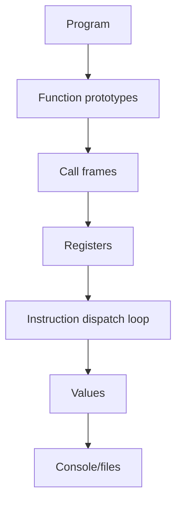

# Silk Virtual Machine

Silk is Spider's current execution engine.

## Architecture

## Values

Runtime values include `Unit`, `Int`, `Float`, `Bool`, `Text`, `List`, `Map`,
`Range`, `Record`, `Variant`, `FnRef`, and iterator values.

Lists, maps, records, variants, and text are reference-counted internally.
Mutation uses copy-on-write so Spider assignment remains value-like.

## Call Frames

Call frames are stored on an explicit heap stack. Spider recursion does not use
the host call stack. The language recursion limit is 1000.

## Memory

There is no exposed manual memory management. The VM uses Rust ownership and
reference counting internally.

## Capabilities

The VM stores an allow-set and checks capability-gated operations at the
operation boundary. This is defense in depth; the checker also enforces
capabilities.

## Runtime Errors

Runtime panics render in Spider Explain format.
